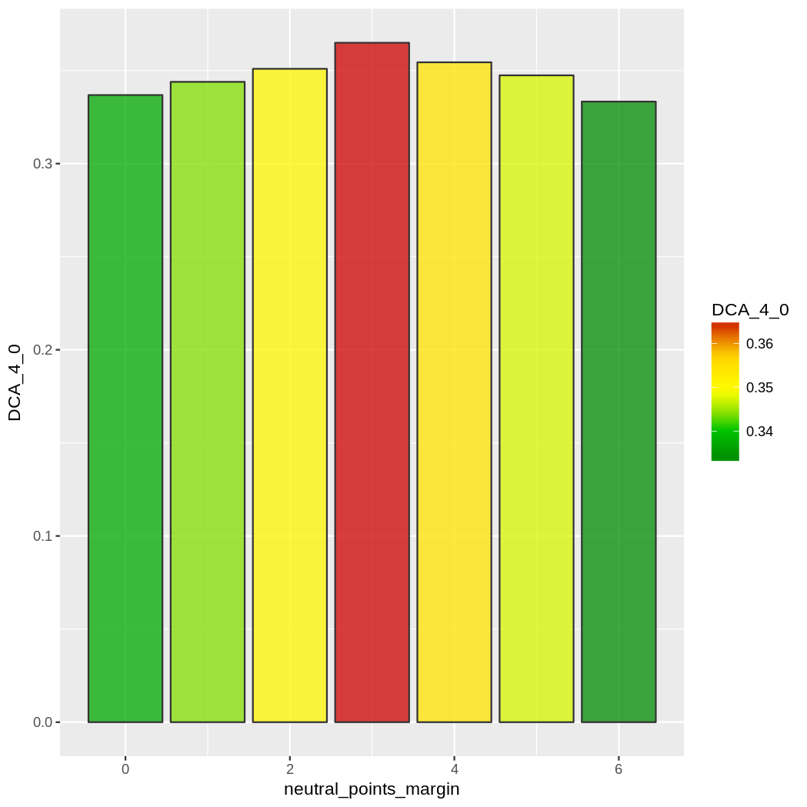

### Introduction

### Prerequisites

Datasets located in `../p2rank-ions-data-rdk/` (cloned from https://github.com/rdk/p2rank-ions-data-rdk) relative to this repo.

Smaller subsets created from original training datasets:
* train200.ds 
* dev100.ds 
* dev200.ds 

See also `config/ions-rdk.groovy` which is used as a base config file.

### Development log

First we will try to use default confguration that was used to train P2Rank's ligand binding site (LBS) prediction model.

Sanity check first: train and eval datasets are the same.
~~~sh
./prank.sh traineval -label p2rank-default \
    -output_base_dir "../../p2rank-ions-results/" \
    -dataset_base_dir "../../p2rank-ions-data-rdk/" \
    -t 2020-01/mg/train200.ds \
    -e 2020-01/mg/train200.ds \
    -loop 1 -log_to_console 0 -log_to_file 1 -log_level ERROR  \
    -stats_collect_predictions 1 \
    -rf_trees 100
~~~     
Results:
~~~
3 minutes 49.33 seconds on 12 cores
DCA(4.0) = 88.4  
AUPRC:   0.9383  area under PR curve
AUC:     0.9999  area under ROC curve
F1:      0.9357  f-measure
MCC:     0.9375  Matthews correlation coefficient
~~~   
Looks good - almost perfect prediction.

Now for real test on dev dataset.
~~~sh
./prank.sh traineval -label p2rank-default \
    -output_base_dir "../../p2rank-ions-results/" \
    -dataset_base_dir "../../p2rank-ions-data-rdk/" \
    -t 2020-01/mg/train200.ds \
    -e 2020-01/mg/dev100.ds \
    -loop 1 -log_to_console 0 -log_to_file 1 -log_level ERROR  \
    -stats_collect_predictions 1 \
    -rf_trees 100
~~~     
Results:
~~~
3 minutes 43.55 seconds on 12 cores
DCA_4_0 = 15.4% (identification success rate for DCA (4A / Top n+0) criterion)
~~~                                 
This is terrible. P2Rank's LBS prediction model achieves ~70% even on similarly small datsets.

First we try to do some preliminary optimization of class balancing parameters using Bayesian optimization (hyperparameter-optimization-tutorial.md).
~~~sh
pkill python; sudo pkill mongo
./prank.sh hopt -c config/ions-rdk -out_subdir HOPT -label balancing-01 \
    -t 2020-01/mg/train200.ds \
    -e 2020-01/mg/dev100.ds \
    -loop 1 -log_to_console 0 -log_to_file 1 -log_level ERROR  \
    -ploop_delete_runs 0 -hopt_max_iterations 2999 \
    -collect_only_once 0 \
    -clear_prim_caches 0 -clear_sec_caches 0 \
    -hopt_objective '"-DCA_4_0"' \
    -balance_class_weights 1 \
    -extra_features '(chem.volsite.bfactor.protrusion)' \
    -rf_bagsize 55 -rf_depth 10 -rf_trees 40 \
    -target_class_weight_ratio '(0.001,0.2)' \
    -positive_point_ligand_distance '(1,10)' \
    -pred_point_threshold '(0.3,0.7)' \
    -pred_min_cluster_size '(1,5)'
~~~     
Results:
~~~       
After 85 iterations (and cca 2 hours):

target_class_weight_ratio,        0.1726
positive_point_ligand_distance,       9.3741
pred_point_threshold,         0.7000
pred_min_cluster_size,        1.0000
value,       -0.3719 (-DCA_4_0)
~~~                                 
Some improvement but still very low success rate.

As an example of grid optimization we try to run it on `neutral_points_margin` parameter, which also influences class balance. 
(Points between (positive_point_ligand_distance, positive_point_ligand_distance + neutral_point_margin) will not be considered positives or negatives and will be left out form training.)
See Params.groovy for description of other parameters.

~~~sh
./prank.sh ploop -c config/ions-rdk -out_subdir HOPT -label balancing-01-ploop-1 \
    -t 2020-01/mg/train200.ds \
    -e 2020-01/mg/dev100.ds \
    -loop 1 -log_to_console 0 -log_to_file 1 -log_level ERROR  \
    -ploop_delete_runs 0 -hopt_max_iterations 2999 \
    -collect_only_once 0 \
    -clear_prim_caches 0 -clear_sec_caches 0 \
    -hopt_objective '"-DCA_4_0"' \
    -balance_class_weights 1 \
    -extra_features '(chem.volsite.bfactor.protrusion)' \
    -rf_bagsize 55 -rf_depth 10 -rf_trees 40 \
    -target_class_weight_ratio 0.1726 \
    -positive_point_ligand_distance 9.3741 \
    -pred_point_threshold 0.7 \
    -pred_min_cluster_size 1 \
    -neutral_points_margin '(0,1,2,3,4,5,6)'
~~~     
Result:

Optimal value is clearly around 3.